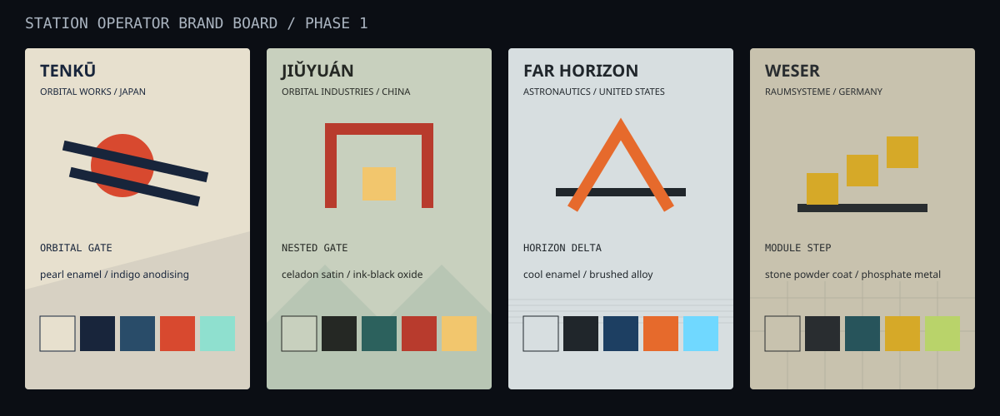

# Station operator brand review

The first four stations use the same requested seed (`27`), resolved seed,
archetype, transforms, solar family, thermal budget, connectivity, and
organisation score. Their only geometry difference is the documented three- or
four-primitive logo. This makes the livery comparison controlled rather than a
comparison of unrelated station shapes.

| Operator | Logo SVG | Review render | Scene | Blueprint |
|---|---|---|---|---|
| TENKŪ Orbital Works | [Orbital gate](logos/tenku_orbital_gate.svg) | [PNG](station_00_truss_tenku_030i.png) | [TSCN](../../assets/station_brand_review/station_00_truss_tenku_030i.tscn) | [JSON](../../assets/station_brand_review/station_00_truss_tenku_030i.json) |
| JIǓYUÁN Orbital Industries | [Nested gate](logos/jiuyuan_nested_gate.svg) | [PNG](station_00_truss_jiuyuan_030i.png) | [TSCN](../../assets/station_brand_review/station_00_truss_jiuyuan_030i.tscn) | [JSON](../../assets/station_brand_review/station_00_truss_jiuyuan_030i.json) |
| Far Horizon Astronautics | [Horizon delta](logos/far_horizon_horizon_delta.svg) | [PNG](station_00_truss_far_horizon_030i.png) | [TSCN](../../assets/station_brand_review/station_00_truss_far_horizon_030i.tscn) | [JSON](../../assets/station_brand_review/station_00_truss_far_horizon_030i.json) |
| Weser Raumsysteme | [Module step](logos/weser_module_step.svg) | [PNG](station_00_truss_weser_030i.png) | [TSCN](../../assets/station_brand_review/station_00_truss_weser_030i.tscn) | [JSON](../../assets/station_brand_review/station_00_truss_weser_030i.json) |
| Auto-selected Far Horizon, dual-keel/ring/dome hybrid (`seed 14`) | [Horizon delta](logos/far_horizon_horizon_delta.svg) | [PNG](station_00_hybrid_dualkeel_ring_dome_060i.png) | [TSCN](../../assets/station_brand_review/station_00_hybrid_dualkeel_ring_dome_060i.tscn) | [JSON](../../assets/station_brand_review/station_00_hybrid_dualkeel_ring_dome_060i.json) |

Review the following separately:

1. Can each operator be identified from hull/structure/collector colours before
   reading the label?
2. Do all four still feel compatible with the player's late-70s hardware rather
   than like four unrelated genres?
3. Are accent and emitter colours sparse enough?
4. Are the marks legible but subordinate at module scale?
5. In Godot's lit 3D view, do enamel, oxide/brushed metal, glass, and powder-coat
   responses feel sufficiently different? The flat PNG renderer shows colour and
   geometry but cannot represent roughness or metallic response.
